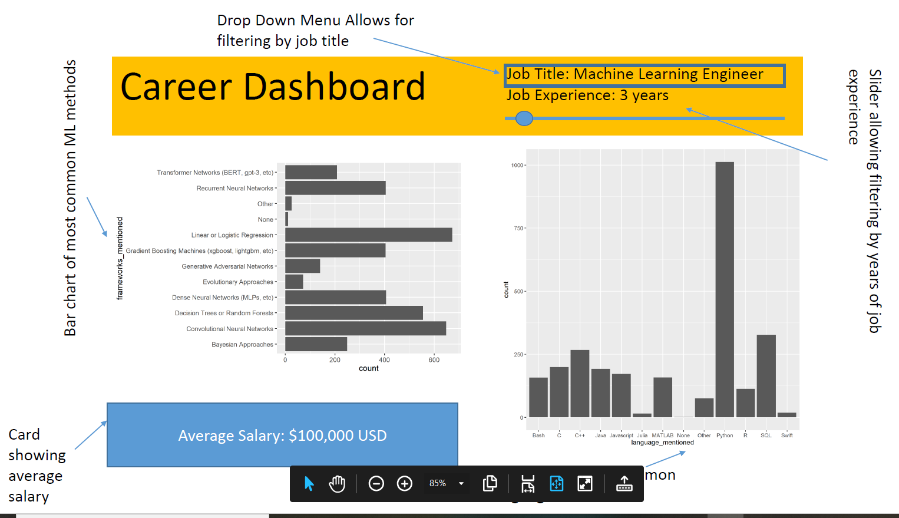

# Dashboard Functionality

## Overview
Our dashboard displays information about reported usage of machine learning approaches, salary, and programming languages for different data science related job titles at different levels of experience.

## Visualizations 
A bar chart on the right displays the frequency individuals in the data mentioned specific machine learning techniques as an integral part of their work. A card will display the mean salary reported for the subset of individuals. Another visualization displays a bar chart with frequencies of the programming languages reported as most commonly used. 

## Interactivity
Across the top of our dashboard, a drop down menu will allow our user to filter the data by given job title. A slider will allow the user to filter the data based on the number of years of experience. These options allow for an in depth examination of how machine learning approaches, programming languages, and salary vary by job position. Upon opening the dashboard, no filtering will be applied so that the user can first examine the overall distribution of these preferences and garner more insight into what is a distinct skill specific to a given job title and what is more of an overarching skill for all data science related professions.

## Visual

