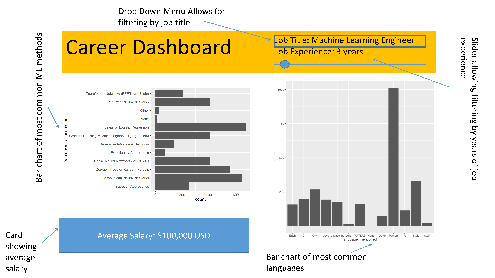

# Data Scientist Career-Decision-Aid Dashboard

The objective of this app is to provide some insight for those Data Scientists who are starting or engaging in their job searching process, by providing certain in-field distinctions between different job titles and experience gaps. These distinctions will include the expected yearly income in USD, the most common tools utilized in their field, as well as the average education level presented/expected from those job titles. Some graphs exposed as output include the average salary per-year for the information provided, bar charts of the most common programming languages and machine learning methods associated with that title, and a pie chart of the education level´s distribution. Because this is a public app, it will be available to anyone interested in the topic, even if they are not part of the target audience (recruiters, teaching staff, etc.). 

Structure wise, the app will include a slider to insert the experience gap they currently find themselves in (between 0 years to ten or more years). Moreover, in a dropdown menu, users will specify the job title their interested in. In reality, many job titles and their specific functions are considerably intertwined, hence, the usage of this dashboard could help a user identify key differences that align more with their profile. Interactive functions will be implemented, allowing the user to modify the color scheme and size of their plot, if their understanding is being affected by the current presentation.

